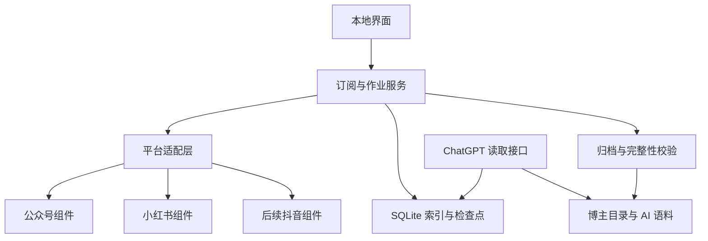

# 双平台内容归档｜技术设计与验证

> v0.3.13真实验证：独立授权浏览器已登录；小红书A首屏+38次API取得1159 ID，B首屏+5次API取得152个唯一ID，均有明确末页。真实归档消费者新进程在保留浏览器会话下收到检查点之后的新响应；自运行认证传输及浏览器重启恢复仍未验证。公众号限制不变，整体G1未通过。详见[实测记录](validation/G1-live-2026-09-26.md)。

> v0.3.12：新增用户提供的Edge HAR分页链验证入口，复用现有事务与去重。报告严格区分捕获响应链覆盖、离线导入进程恢复与真实认证采集恢复，前两项不能替代第三项；本轮只有42项离线/本机测试，无新真实HAR证据。

> v0.3.11 条件确认：用户没有公众号后台管理/运营权限，后台采集模式当前不可验证；WeWe 最新单篇不能替代历史，既有站点工具拒绝仍有效。双平台 P0 不变；下一步聚焦小红书认证分页传输，G1继续未通过。

> v0.3.9 实施记录：已实现统一订阅快照、按作者逐页批次、稳定 ID 去重、独立正文/媒体导入与离线导出合同；`full`、`latest`、`archive` 使用独立批次，`latest` 暂无安全早停依据，仍逐页遍历。小红书新增需外部注入认证 `user_posted` 响应的严格页适配器，未接入真实传输。WeWe 隔离分支 `codex/history-state-guard` 把单篇封面历史状态改为未知并阻止伪分页。上述代码与模拟测试不构成 G1；公众号真实多篇历史来源和双平台真实末页仍待验证。

> v0.3.7续验更新：XHS 原有 80/152 个真实 ID 与媒体证据保留；既有作者页本轮无法重新绑定，未增加真实页证据。WeWe `4f0b426` 已加入原生 WeRead 认证与正文兜底，但 `/api/mp/cover` 忽略页码，不能提供四页历史或末页；本轮扫码和刷新也未完成。公众号样本仍受工具站点策略拒绝，正式适配器待定。详见 [真实G1记录](validation/G1-live-2026-09-26.md)。

> 2026-09-26 阶段更新：用户已授权技术验证与应用开发；G1 真实双平台证据尚缺。当前执行范围与组件复核见 [首轮验证记录](validation/G1-2026-09-26.md) 和 [ADR-001](ADR-001-validation-boundary.md)。下文设计保留基线依据；阶段以本条及 PROJECT_STATUS 为准。可运行验证骨架与未实现范围见 [07](07_验证骨架运行与接口.md)。

版本：v0.2（开发前评审稿）｜日期：2026-09-26｜状态：设计基线；实验骨架已实现，正式适配器待G1

## 架构与复用边界

首选方案仍为 Windows 本地网页 + Python/FastAPI 服务 + SQLite 持久队列 + 本地媒体目录。Python 版本、前端框架、打包方式在适配器验证后锁定依赖版本。现有 Node/Go/Python 平台组件可通过本地 API 或受控子进程适配；不让不同项目直接共享写入同一数据库。优先复用登录、解析和下载能力，自有核心只统一订阅、覆盖统计、作业恢复、目录和语料。

第三方组件选型见 04，不能依据 README 就锁定全历史能力。先完成能力与许可验证，再记录架构决策 ADR；禁用依赖组件中此次不需要的发布、点赞、评论等工具。

## 平台适配协议

| 接口 | 最小返回值 | 约束 |
| --- | --- | --- |
| resolve_creator(url) | platform、author_id、name、canonical_profile、evidence | 作品链接反查与主页链接两种入口；名称不是身份 |
| capabilities() | creator_resolution、history_pagination、detail、media、cursor_resume、known_limits | 能力按模式和版本登记，不能把 weread_mp 与公众号后台模式混为一谈 |
| list_creator_items(author_id, cursor) | items、next_cursor、has_more、terminal_evidence、observed_at、error | 明示页大小/硬上限；只支持首屏的组件不得声称完整历史 |
| get_detail(item_id) | 原文块、发布时间、作者、媒体引用、来源、解析版本 | 空白主体不是成功；作品 ID 与作者 ID 交叉检查 |
| list_assets(item) | 顺序、类型、可获取档位、临时源地址、预期信息 | 封面、普通视频、视频号卡片分型 |
| fetch_asset(asset, checkpoint) | 本地临时文件、字节数、实际 MIME/质量、校验结果 | 字节续传能力单独登记；不支持时仅重下失败文件 |

公开分页接口不足时可验证用户授权会话中的浏览器正常加载方式；若仍无法获得完整作者历史，应报告能力不达标，不能将首版悄悄降为单篇下载器。平台验证、验证码或访问限制需要用户处理，不设计规避限制的账号/IP 轮换。

## 逻辑数据模型

- **Creator**：内部 ID、platform、author_id、display_name、name_history、profile_url、archive_dir；唯一键 `(platform, author_id)`。目录映射持久化，改名不重复建库。
- **Subscription**：creator_id、enabled、credential_ref、adapter_id/version、last_attempt_at、last_success_at、last_full_scan_at、latest_watermark；取消订阅默认保留已有文件。
- **ScanRun / ScanCheckpoint**：subscription_id、mode(full/latest)、cursor、page_count、seen_count、earliest/latest_published_at、terminal_evidence、coverage_state、stop_reason、adapter_version、started/finished_at。完整历史状态绑定具体扫描时间与访问模式，不表示永久完整。
- **ContentItem**：platform、item_id、creator_id、canonical_url、title、published_at、fetched_at、ordered_blocks、text_hash、source_method、parser_version、detail_state、missing_reason。唯一键 `(platform, item_id)`。
- **MediaAsset**：item_id、asset_id、position、kind、relative_path、bytes、sha256、mime、quality、download_state、source_expiry、error。敏感临时媒体地址不进入 Git 或普通导出。
- **Job / JobItem**：batch_id、kind、target_id、state、attempt、next_retry_at、lease_until、checkpoint_ref、outcome、error_category、progress_counts；每个博主与每篇内容均可恢复。
- **ExportRun**：scope_snapshot、target_root、manifest_version、started/finished_at、counts、missing_items、integrity_result。保存本次全库下载选取的订阅快照，过程中新增订阅另列待下一批。

当前 `workflow.py` 是 G1 前最小实验实现：使用新的独立 `archive.sqlite3`，保留固定批次的订阅快照和逐页检查点，不读取或迁移旧验证库。正文暂为纯文本，HTML/Markdown 只保留文本和已导入本地媒体的相对链接；并发租约、真实自动下载、丰富原文块、预期附件数及产品 UI 尚未实施。导出清单明确记录已登记媒体缺失与 `unknown_expected_count`，避免把字节已存误作全部可获取媒体完整。正式目录格式和旧资料迁移仍以 G2/G5 验收为准。

订阅、历史扫描、详情、媒体、导出状态分开；不得只用一个 success 字段覆盖所有含义。SQLite 负责队列持久化，崩溃恢复回收过期租约，唯一索引防重复；预期规模以实际样本压测后确定，不提前引入分布式队列。

## 三类操作及持久恢复

### 更新全部内容

以全部订阅（含暂停订阅）创建批次，为每位博主做完整历史扫描；已有完整档案也允许重新核对历史，以发现补发和修改。各平台默认低并发，逐博主记录进度。订阅暂停影响自动调度；用户显式手动全量操作按全部范围执行，不改变暂停设置，作业自身另有暂停/继续状态。

每页：请求 → 校验列表与游标 → 事务写入作品 ID、详情任务和下一游标 → 提交后再请求下一页。游标失效时记录原因并从可证明安全的位置重扫，通过唯一键去重。配置上限、重复游标、空页但还有下一页、平台报错都导致 partial/blocked，不得视为完成。可靠末页信号或经过验证的页面终止证据才标记“当前可获取范围已遍历”。

不能从数据库已有总数反推页码，因为删除、置顶、重复和中途失败会导致跳页。扫描期间源数据变化可能造成漂移，应保留重叠页/复核首段并去重；持续变化导致不能证明完整时显示覆盖不确定，不承诺原子快照。

### 检查最新

与 full 分开记录水位。按经过验证的排序与游标读取到已知区间，置顶作品不作为提前停止依据；没有可验证的排序保证时继续分页或转全扫描。检查最新成功不等于历史完整。定时更新后续复用此流程。

### 按博主下载全部

点击后固定“全部订阅（含暂停订阅）”范围，不取 UI 当前分页/筛选。扫描不完整或从未扫描的博主先补全历史；随后拉详情、下载未完成媒体、渲染 HTML/Markdown、生成作者及全库索引/清单/语料。已经校验完成的文件可跳过，失败只重试对应阶段。任务最终分别汇报覆盖、正文和媒体完整性。

重复点击相同运行任务返回原 job_id；取消仅停止后续调度，保留已完成文件。磁盘不足、目录无权限等可恢复错误暂停写入。断电后依据数据库检查点与 .part 文件恢复；下载器不支持 Range 时明确为重新下载失败文件。

## 状态与重试

作业状态：queued、running、paused、needs_login、rate_limited、partial、succeeded、failed、cancelled。401/登录失效进入重新登录；429 按 Retry-After/验证过的冷却策略暂停；超时/5xx 有限指数退避及抖动；页面结构变化停止该适配器并保留脱敏诊断。人工与定时更新共用去重、节流与冷却，重复点按钮不能绕过冷却。

历史覆盖：unknown、scanning、complete_for_accessible_scope、partial、blocked；媒体完整性独立按文件计数。一次空结果不是“无历史”，只有成功且可信的完整响应才能推进成功时间和游标。

## WeWe 针对性诊断与改造

依据用户 fork `4cd64f1`：refreshAll 只取第一页；批量异常被吞后 UI 仍可能显示全部完成；历史游标驻内存、起点用已有条数估算；随机账号选择和分散重试不利于定位。改造重点是结构化逐源结果、持久历史任务、真实完成条件与统一退避，复用 MIT 许可下已有正文/Obsidian 逻辑时补附件完整性。

先获取用户实际部署版本与脱敏失败日志，按“列表服务→账号→分页→正文→媒体→导出”定位，静态线索不能直接当根因。旧版 `4cd64f1` 文章列表经第三方服务发送 Bearer token；新版 `4f0b426` 的认证、封面及正文兜底已改为直连微信读书，旧配置残留不等于这些路径仍在发往中转。新版 `/api/mp/cover` 最多返回最新一篇且忽略页码，下游却据不足20篇标记历史结束；须以能提供真实逐页 ID、游标和末页的来源替换此历史路径，不能用另一种“仅最新一篇”模式替代。外部服务不可用须显式失败，不能伪装“无更新”。

## 归档、语料与离线校验

目录规则以 02 为准，稳定作者 ID 与作品 ID 防重名。流式写 .part、检查实际类型/大小/可打开性、计算哈希后原子 rename。校验长度以可用响应信息为准；HTML 错误页不能保存成 MP4。不把远程图片代理 URL 当成本地图片。重试不覆盖已校验的高质量文件。

`article.md` 和 `index.html` 由同一 ordered_blocks 生成，保留图序、段落、标题、列表、引用；净化脚本、外部跟踪资源和危险链接。所有本地引用检查路径存在且在归档根目录内；Markdown 不宣称像素级还原复杂公众号排版。导出原子更新生成文件，用户编辑的笔记与手工标注置于独立文件，冲突时另存版本。

作者 `manifest.json` 记录预期/实际作品和资产、覆盖状态、错误与版本；`corpus.jsonl` 一行一作品，至少有 platform、author_id、item_id、source_url、published_at、text、media_refs、status、content_hash、schema_version。失败说明不能混进 text 冒充原文；OCR、转写和模型总结有独立 provenance 字段与文件。语料用于后续分析，不默认上传或启动模型微调。

公众号普通视频、视频号卡片、HLS 分开验证；Access 项目本身不支持 HLS，也不能保存视频号本体，不能继承一个不存在的能力。有授权可取得的视频保存文件；取不到保留来源与缺失状态。

## ChatGPT / MCP 接口

首版只读工具：`list_creators`、`get_creator_coverage`、`search_items`、`get_item`、`list_assets`、`read_corpus_page`、`get_analysis`。指定链接映射已归档记录的 `lookup_url` 也只读。响应包含总数、返回范围、next_cursor、覆盖状态、来源和内容类型，不将截断内容冒充全量。

需要远程抓取、创建订阅、启动更新或写文件的操作是有副作用工具，不能标 readOnly；首版由本地界面触发，后续如加入 MCP，单独声明能力和用户授权。图片通过实际工具资源返回；视频需转写/关键帧或客户端支持的实际媒体输入，本地路径字符串不是模型已看过视频的证据。

本地服务仅监听回环，认证后仅可读取配置的资料根目录；按官方 [Secure MCP Tunnel](https://developers.openai.com/api/docs/guides/secure-mcp-tunnels) 与 [ChatGPT 接入说明](https://developers.openai.com/plugins/deploy/connect-chatgpt) 验证连接。实际账户权限、连接建立、一次新会话读取均为验收点；无法连接则记录该项未通过。不得用连接绕过已出现的站点访问限制。

## 安全与依赖管理

本机安全凭据存储，日志/导出/Git 脱敏，原始含 token 分享链接如确需缓存只保存在受限本地状态。链接与每次重定向均检查域名及目标地址，防止读取回环/内网敏感服务；文件路径限制在用户选定根目录；默认不开公网端口。凭据、真实下载内容、数据库与用户笔记不得进入仓库。

每个第三方组件记录 commit、许可证、来源、修改清单、调用方式、测试样本与降级方案。API/子进程隔离便于升级与替换，不是绕过许可证的工具。依赖更新先在兼容性测试中验证，再调整锁定版本，不自动跟随 master。

## 验证门槛与追溯

| 阶段 | 对应需求 | 必须留下的证据 |
| --- | --- | --- |
| G0 文档与环境 | R01–R13 | 文档评审、系统/路径、样本授权与账号模式、依赖许可及固定版本 |
| G1 双平台作者枚举 | R01–R04 | 每平台至少两位博主；至少一位真实跨四页，小红书建议 50 条以上；逐页 ID/游标、可信末页、置顶/重复/删除边界及跨进程恢复去重；取消订阅保留档案、暂停恢复；不能仅展示首屏 |
| G2 全库下载 | R05–R09 | 全部订阅批次，不受列表筛选；按作者目录；图文与视频/卡片区分；断网、整体移动后可读；manifest 对照 |
| G3 恢复与故障 | R10 | 跨页中断重启、401/429/空页/重复游标、单源失败不吞错、磁盘不足、同名改名、失败项重试 |
| G4 AI 与连接 | R09、R11 | 语料来源可追溯，纯读取不触发下载；分页有覆盖信息；真实 ChatGPT 会话读取正文/图片证据 |
| G5 发布与同步 | R12–R13 | Windows 安装/启动、搜索筛选、目录配置、卸载保留资料、备份迁移、Git 远端提交可见、无凭据及内容库入仓 |

上表需求编号以 01 的当前版本为准，实施拆任务前逐项核对。模型测试与故障模拟不能替代真实多页作者验证；当前 G0 已完成授权、环境与候选许可复核，账号/样本部分待补；G1 已做静态复核和离线合同测试但未真实通过；G2–G5未验收。G1 不通过就调整组件方案并报告缺口，不进入“完整订阅”发布。
