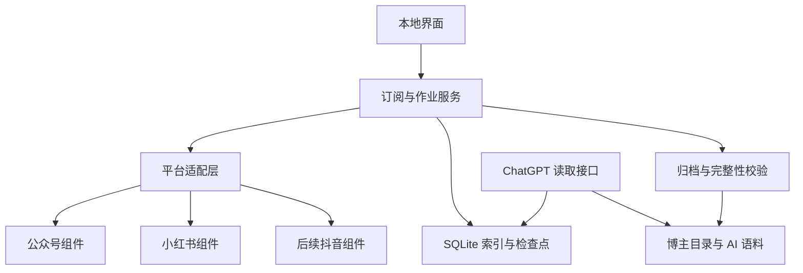

# 双平台内容归档｜技术设计与验证

## 2026-09-28 全订阅批次的已有检查点接入边界

`all_archive`创建固定作者快照时，对每位已确认小红书作者先查最新`author_archive`父任务：若未完成且未归属批次，关联其原`job_id`，保留原run、页、固定内容目标、成功资源与失败原因，不自动执行；若已属其他批次则拒绝重复关联，若无可接入任务才新建并执行。`archive_batch_members.reason=existing_checkpoint`只标注接入来源，成员API另外给`reused_existing_job`；旧表和schema2导出均不迁移。批次汇总仍分别显示历史可信末页与正文媒体结果，接入关联不等于本批真实执行。

合成11项批次回归、完整Python 195项（1项既有跳过）和前端合同通过；实际库经备份后建立批次26，只关联原48/55、无新作者任务/线程、10张业务表和3,720文件保持，SQLite integrity=ok。[脱敏记录](validation/G3-all-archive-adoption-2026-09-28.json)。此为真实跨作者**关联**证据，没有批次恢复或新离线读回，G3尚未通过；A/B目标游标仍缺响应，WX G1/G2/G3及P0继续未通过。

## 2026-09-28 深页重放空闲期限与A父55真实复验

触发：父55/run24第10页24项待处理，跨进程恢复需要从主页重放到原请求游标；旧_fetch把30秒作为全部重放总期限。合成慢页链每4秒返回同作者有效新页，旧实现于目标页前timeout。现复用Playwright 1.58.0和现有规范页校验，仅当不同请求游标的已验证列表响应新增时重置空闲期限；重复页、SSR末页或无有效进展仍超时，精确目标响应仍是提交前提。定向回归先红后绿，完整Python 194项通过/1项既有跳过；无依赖、数据库或导出迁移。

真实复验先对当前实际库完整备份并指纹3,720个归档/下载文件。正常Start后仅恢复原55一次：8项再次reference_missing，之后记录requested_response_missing，即浏览器显示末页却无检查点所需精确API响应；不能把显示状态当可信末页。仍10页300次出现/300唯一ID、268成功/8缺引用/24待处理，页码/游标连续且run检查点匹配最后下一游标；无新页、新正文或附件。旧30秒总期限的合成缺陷已修，但不能证明前次真实timeout唯一根因或平台能返回目标页。正常Stop后SQLite integrity=ok、0活跃、3,720旧文件哈希/mtime零变化；仅父55/run24状态、子57更新时间、8条失败快照及24个指标尝试时间变化。脱敏证据见[机器记录](validation/G1-xhs-a-idle-replay-2026-09-28.json)，私有备份/指纹在实际workspace同级private-validation/xhs-a-full-2026-09-28。WX G1/G2/G3、实际跨作者all_archive G3与双平台P0未通过。

## 2026-09-28 作者A检查点超时与双作者既有导出读回

A父55/run24第10页内容阶段中断后有24项待处理且列表无末页。预期同run先补固定未完成项再续原游标；实际仅恢复55一次：旧8项再次reference_missing，随后列表重放timeout；父/run blocked，10页300唯一目标、268成功/8缺引用/24待处理不变，第10页仍6成功/24待处理。10页游标连续且检查点匹配最后下一游标，terminal_evidence为空；没有新页或第二次重试，超时不能充当末页。8条新失败快照和24个指标尝试时间只记录本次尝试；外部根因未知。

先另存实际库完整私有SQLite备份，integrity=ok。平台受阻后只读检查既有B导出54和A导出66：全库160/1,247作品、152/269正文、348/590有效附件，作品ID零交叉；manifest/corpus/index、842份正文与938附件合计1,786文件/178,811,551字节经本机HTTP与磁盘逐字节比对，正文哈希及附件大小/SHA正确，作者目录隔离，0登记附件缺失。这是既有作者快照的读回，不是实际all_archive批次、run24末页或双平台P0。正常Stop后0活跃/0冷却、SQLite integrity=ok，旧1,482文件大小/mtime/SHA零变化；除父55/run24状态、子57更新时间、8条失败快照与24个指标尝试时间外，其他业务表行未变。无代码变更，未重跑离线套件或浏览器图片解码。[脱敏记录](validation/G1-xhs-a-timeout-g3-readback-2026-09-28.json)。

下一次只在独立浏览器可访问A主页及原游标所需列表响应时从原55有界恢复；登录/验证由用户处理，冷却则等待，不换账号/IP。B48原游标缺响应、公众号原链接工具拒绝、WX G1/G2/G3、真实跨作者G3及双平台P0仍未通过。

## 2026-09-28 作者A父55同run续验至10页与离线边界

沿用既有私有SQLite备份/1,482旧文件指纹，在0活跃任务、无冷却、服务已停时正常Start，只恢复父55/run24一次。它先处理原已列页的待处理项，再提交第6–10页；第10页内容阶段正常Stop。10页共300次出现/300唯一稳定ID，页码、游标链连续，run检查点匹配第10页下一游标；仍未观察可信末页，`coverage=partial`，268项正文与当前可观察媒体成功、8项`reference_missing`、24项待处理。旧run1/6的39页/1159 ID及末页只作对照，不并入新run。8项缺引用原因未证明，不能伪造token或将错误当作末页。

父55停在内容阶段，因此其成功记录一度没有新导出正文文件；独立本机作者归档任务66为A的全库1,247作品/269正文生成新manifest、corpus、索引和逐篇文件。268项新run成功作品全部在manifest/corpus中，正文文件和哈希一致；590登记附件大小/SHA有效，本机HTTP对合计1,129文件/123,156,388字节逐字节读回0错误。任务66的manifest `coverage=complete_for_accessible_scope`继承**历史已完成扫描**，不构成run24的可信末页，也不证明全订阅G3。最终SQLite integrity=ok、旧受保护行和1,482旧文件SHA/mtime均0变化，服务正常Stop、0活跃任务。无应用代码/表/依赖/导出格式变更；未重复跑离线套件或做浏览器图片解码。私有原始备份与指纹仍在workspace同级`private-validation/xhs-a-full-2026-09-28/`，[脱敏机器记录](validation/G1-xhs-a-resume-2026-09-28.json)。下一次只恢复55，先补第10页24项，再继续页链；WX G1/G2/G3、双平台P0及真实跨作者G3未通过。

## 2026-09-28 小红书作者A新父55：检查点与内容部分验收

只读确认旧run1/6各39页、1159唯一ID、连续游标及明确末页；这是旧扫描证据。为同一已确认且启用的作者在0活跃任务、无冷却且实际服务停止时，先新建私有SQLite在线备份并指纹旧1,482文件，再创建独立`author_archive`父55/run24。首次第2页内容阶段正常Stop，检查点2页60目标/42成功/6超时/12待处理；正常Start后只恢复原55一次，未新建run，推进到第5页。再次正常Stop后新run是5页150次出现/150唯一稳定ID，页游标连续且检查点匹配最后下一游标，**无可信末页，coverage=partial**；128目标正文及当前观察媒体成功、8项缺有效访问引用、14项待处理。新会话把部分超时项明确归为`reference_missing`，具体页面引用为何缺失未证明。旧39页终页不能接入此run。

SQLite integrity=ok；旧jobs/runs/pages/subscriptions/pipeline及旧资产行0变，旧1,482文件SHA/mtime 0变，新增归档/下载文件807。128成功项正文非空、媒体状态完成，286个登记附件大小/SHA逐一有效。未运行HTTP/浏览器解码，也未另建全库导出或全订阅批次，因此不能把本轮已列内容、全库内容和真实跨作者G3混算；平台未暴露媒体仍不可枚举。私有备份/指纹/审计在workspace同级`private-validation/xhs-a-full-2026-09-28/`，[脱敏机器摘要](validation/G1-xhs-a-archive-2026-09-28.json)。继续时只恢复55，保留成功资源；按页父任务当前不提供补链接输入，缺引用项若有同篇官方完整链接，先走单篇保存入口补齐作品再恢复55，或等待后续真实可观察引用，不伪造token。B父48、旧32/35、42/43及前10篇Demo未操作；WX G1/G2/G3、双平台P0仍未通过。无应用代码/数据库/导出变更，本轮未重复离线测试。

## 2026-09-28 小红书游标失败分类与父任务48有界复验

**触发/预期/实际**：父48/run22在真实第6页请求和一次跨进程恢复后都只留下`invalid_cursor`，无法从持久记录分辨同一请求游标的响应内容冲突，还是页面显示末页却未观察到目标游标响应。预期是两种故障分别可见，均保持原5页/150项目标、资源及partial覆盖，不将SSR末页或旧run19末页写为当前终页。源码定位到`_observe`和`_fetch`两条路径；旧记录本身不能倒推出当时走了哪条。

**最小修复**：同请求游标的不同规范页记`cursor_response_conflict`，浏览器显示末页而目标游标响应缺失记`requested_response_missing`，旧`invalid_cursor`记录继续可读并明确提示原因未细分。主页SSR先显示`has_more=false`时，正常滚动一次以给所需API响应到达机会；仍缺失则阻塞，绝不把SSR当API末页。没有改变页提交、检查点、版本、库结构、导出、依赖或已有文件。复用[既有XHS研究](research/xhs_reuse_report.md)和Playwright传输，不增加采集通道。

**验证**：合成回归先红后绿，分别覆盖双响应冲突、SSR伪末页但滚动后目标响应到达、滚动后仍缺响应；临时SQLite上的两种错误持久化、原检查点/成功附件保持及恢复继续通过。最终代码完整Python回归192项运行、191通过、1项跳过。另在0活跃任务、无冷却并新建私有SQLite在线备份与1,482文件指纹后，正常Stop→Start，只恢复原48一次；真实结果是`requested_response_missing`，仍5页/150已完成内容，未提交第6页、无可信末页。此新分类只说明**目标响应未观察到**，平台为何不发或浏览器为何未观察到仍未知；没有再次恢复。关闭服务后SQLite integrity=ok，只有任务48与run22两行变更，旧文件0变、新文件0、页面105行及资产370行总数不变。私有证据在workspace同级`private-validation/xhs-b-cursor-2026-09-28/`，脱敏摘要见[机器记录](validation/G1-xhs-b-archive-2026-09-28.json)。

## 2026-09-28 小红书较小作者独立全历史归档：内容通过，列表未到末页

在0活跃任务且无平台冷却时，先在线备份实际SQLite并记录旧文件/业务行指纹，再为既有6页/152 ID证据的已确认作者创建独立`author_archive`父任务48/run22；没有恢复旧35或扩大前10篇Demo。真实浏览器本次提交5页、150唯一ID，固定子任务49–53均成功，其中142项复用既有完整资源、8项本轮补成，新增21项资产。请求第6页时触发`invalid_cursor`，父任务与run均保持`blocked/partial`，没有可信末页。正常Stop→Start后只恢复原48一次，同一游标仍失败，页数、目标及已成功内容不变；未再循环请求。

只读对照旧run19：新前五页与旧前五页游标链相同，第3页集合互有8项差异；旧第6页2项未在新前五页出现。当时持久错误类别未区分“同游标不同响应”和“未收到请求游标响应”，**当时具体路径未知**；不能把旧第6页的`has_more=false`搬入新run。新扫描清单150/150内容成功、10项本地库独有，但历史覆盖仍为partial，外部未见范围不可枚举。

关闭采集浏览器后，另建不访问平台的作者导出任务54；它按全库导出160作品、152行正文，不能当作本轮150项目标或全历史完成。针对新run的150项目标，本机磁盘及HTTP逐字节读回300份正文文件、344张WebP，150篇正文非空，资产大小/SHA一致；独立本机浏览器实际解码344/344张。`media_coverage=unknown_expected_count`仍表示无法证明平台未暴露的附件不存在。SQLite完整性`ok`，旧任务/页/订阅等受保护行0变化，旧1,400个归档及下载文件SHA/mtime 0变化；原32/35/42/43范围保持。私有备份与逐项证据在workspace同级`private-validation/xhs-b-full-2026-09-28/`，公开[脱敏机器摘要](validation/G1-xhs-b-archive-2026-09-28.json)。本轮无应用代码、数据库结构或导出格式变更；双平台完整P0及WX G1/G2/G3仍未通过。

## 2026-09-28 新公众号样本 G1 判定

用户提供的“妈妈部落畅聊阁”文章在本次网页工具中返回不可重试的打开失败；未改走其他入口访问同一链接。无法由此验证页面身份、稳定 `__biz`/`mid/idx`、正文媒体或历史列表。新的 GitHub 固定源码核查仍未提供该目标原来源的有效首屏、跨页和可信末页，详见[公众号复用核查](research/wechat_reuse_report.md)。本项目没有运行真实公众号采集，也没有生成检查点；旧前10篇Demo、32/35任务及手工资料未动。**WX G1/G2/G3、双平台完整P0继续未通过**；旧 XHS 39/6 页、列表末页与部分正文证据保持原边界。

下一次允许的真实验证先把文章所示作者与稳定平台ID交叉核对，再另建有界任务/备份，从原来源取得首屏和下一页，记录响应页、主次条ID、重复项、失败原因及明确终止信号；只有页事务落盘并跨进程恢复后，才可评估接入现有归档管线。来源拒绝、空页、达到预算或有限合集均保持 partial/unknown。新任务可先推进较小小红书作者的独立全历史归档，再做订阅生命周期与全订阅真实验收，不因公众号阻塞停止P0工作。

## 2026-09-28 补充：G4模型可见图片的判别材料

原1×1合成PNG只能证明工具返回有效字节，不足以判断模型是否看见实际画面。独立`scripts.mcp_synthetic_lab`现生成128×96可辨认的三色布局图，图片仍走正式只读MCP工具及附件校验；HTTP与MCP图片块字节一致、PNG解压像素核对，正常退出清理临时资料。测试提示不披露颜色/空间关系，使新ChatGPT会话在实际调用`read_image`后自行描述第一张图，验收者再与本地预期对照。若模型只复述URL/元数据、看不到图或未调用工具，记录未通过；不能用本机SDK结果推断ChatGPT视觉支持。桥接指示将外部作者内容视为不可信数据。浏览器连接本轮再次不可用；证据见[2026-09-28记录](validation/G4-mcp-vision-2026-09-28.json)。

## v0.4.20 补充：官方本地隧道兼容与 G4 接入条件

官方Secure MCP Tunnel已支持直接stdio，无需把本机FastAPI或资料目录暴露公网。实际验证链为Python MCP客户端 → 官方tunnel-client v0.0.15的本地`dev proxy` → stdio只读桥接 → 合成临时库GET；本地控制面没有托管身份认证，不能据此宣布ChatGPT连接或G4通过。三页六作品/正文、来源、图片块与资源字节、损坏拒绝、文件及库纯读均通过。新增合成验证启动器只创建临时库，不接受实际资料根目录，正常停止清理。

预期错误复现：传`cursor=-1`给`search_items`，原ValueError被SDK隐藏成`Error executing tool search_items`。现对分页、缺平台、缺作者用SDK的ToolError返回参数/作者核对及资料保持提示；回归先红后绿。既有协议和数据格式不变，无旧资料迁移。

真实路径还需Platform组织Tunnels权限、运行key、目标ChatGPT工作区关联及开发者模式。隔离无凭据doctor失败属于预期；本账户未能查看，浏览器工具两次初始化超时。详见[连接核查证据](validation/G4-mcp-connection-2026-09-27.json)与[07操作/停止/结果入口](07_验证骨架运行与接口.md)。本轮未访问真实资料/平台、启停真实服务、开放公网或调用付费模型；双平台G1/G3、完整P0及真实G4仍未完成。

## v0.4.20 补充：本机只读 MCP 协议验证

独立 `creator_archive.mcp_readonly` stdio 进程复用现有回环 GET `/api/workspace`、`/api/items`、详情及附件路由，不实例化会升级/写库的服务；只允许显式端口的本机回环HTTP，不暴露POST。7个白名单工具带只读注解，作者/作品/语料分页返回总数与 `next_cursor`；语料按作品页列出缺正文状态，图片工具返回MCP图片块并有原始字节资源。只读入口再次通过现有附件SHA/大小校验，限制图片类型与10 MiB。实时列表并非事务快照，并发写入时需重遍历和稳定ID去重；历史未见范围仍为未知。

固定官方Python SDK `mcp==2.1.1`，实际stdio客户端对独立合成HTTP服务读3页6唯一作品/正文/来源、图片块及资源字节，同大小损坏附件拒绝；文件SHA/mtime及业务表计数读前后保持。此为本机协议实测，仍缺真实ChatGPT连接、真实资料读取和G4会话证据；双平台G1/G3亦未通过。证据见[本机MCP记录](validation/G4-mcp-local-2026-09-27.json)，操作见[运行说明](07_验证骨架运行与接口.md)。无数据库/导出迁移。

## v0.4.20 补充：G4本机浏览器工具读回边界

以独立临时工作区和合成作者建立5页（跨页重复、明确末页）、6个唯一作品及6张图片；仅在该工作区启动回环服务。实际Playwright浏览器工具通过本机HTTP分页读取 `GET /api/items?limit=2&offset=0/2/4`，三页各2条、总数6、稳定ID去重后仍为6；再读取详情、`/api/jobs/1/scan`、全库`manifest.json`/`corpus.jsonl`及附件URL。正文和来源URL与语料对应，扫描清单显示5页、6个观察/目标/完成作品与重复页号；浏览器获取图片后用`createImageBitmap`实际解码为1×1 PNG。原合成PNG的IDAT CRC错误，首次浏览器解码失败；只修正测试夹具CRC后重建临时工作区，复测通过。

浏览器读取前后30个临时工作区文件的SHA-256/mtime汇总同为`b8748e377051c44103befff01c14559bcf4f01d74493e983beb662c68a66a31`，jobs/runs/pages/items/assets分别维持6/1/5/6/6，运行任务0；仅调用GET，无采集任务。此为**实际浏览器工具对合成本机服务的读回**，高于TestClient模拟，但不是ChatGPT MCP连接或真实平台/资料验收。现有列表API提供`total/offset/limit`供读取端遍历；设计中的`next_cursor`、只读MCP工具与图片资源返回尚未实现，G4仍未通过。证据摘要见[本机工具读回记录](validation/G4-local-tool-2026-09-27.json)。

## v0.4.20 补充：已登记附件文件路由完整性

触发：合成作品已登记附件被删除，或原路径写入同大小但SHA-256不同的字节；使用详情曾返回的旧URL或手工拼接`GET /archive/{relative_path}`。预期不返回无效附件字节，恢复原字节后同一URL可读，其他有效附件、普通导出文件和手工资料保持。修复前损坏文件仍返回200及损坏字节。现路由在原路径/扩展名检查后，查找该相对路径的附件登记并复用现有大小/SHA-256校验；已登记且无效时404，未登记归档文件继续按原规则读取。合成TestClient定向先红后绿，完整回归见状态/日志。未改旧文件、数据库、导出格式或依赖；旧离线HTML快照仍可能含历史链接，须使用本轮任务返回的导出路径。仅HTTP路由受此校验，直接从磁盘读取旧文件不经路由；真实平台/G1/G3验收仍未通过。

## v0.4.20 补充：作品详情附件有效性合同

触发：合成作品登记两张图后删除一张，再写入与原图同大小但SHA-256不同的字节。预期详情API和界面均不向这张图提供可点击/预览链接，仍显示登记和可执行的补媒体提示；另一有效图、手工资料不变；恢复原字节后链接及本机HTTP读回。修复前API对`missing`仍给`url`，界面生成“打开附件”与预览。现先校验再生成URL，缺失/损坏时`url=null`；界面也以`state=complete`为链接/预览前提，防旧响应含URL。合成TestClient与Node DOM合同通过；无表/导出格式、依赖或旧文件迁移。直接访问旧附件URL的路由完整性由上方补充合同覆盖；不等于真实平台/G1/G3通过。

## v0.4.20 补充：全订阅附件缺失/损坏读回合同

触发：合成双作者首次归档成功后，删除首位作者一项附件、将另一项改为损坏字节；新批次媒体下载故障。预期新导出manifest逐项标`missing`、`missing_registered_assets=2`，新HTML/Markdown/索引与corpus不生成这两项的离线链接，另一作者成功资源及手工笔记不变；原批次重启恢复只补原失败作品，链接和附件字节可读。实际：初始回归夹具沿用缓存传输实例使故障未注入，改正夹具后上述合同全部通过，无生产实现缺口。现有大小/SHA-256校验、成功资源复用与`_managed_write`满足本轮；无需新依赖或迁移。旧导出及可能被用户编辑的旧文件仍保留，可能包含损坏前链接；当前有效入口须以本轮导出返回的`index_url`/`manifest_url`及`files`为准，不能将旧固定`index.html`当作最新快照。只用临时库/TestClient，未操作实际资料或真实平台，G1/G3真实验收不变。

## v0.4.20 全订阅读回合同与Windows相对路径

触发：合成双作者`all_archive`中首位作者一项`item_unavailable`、另一作者成功，首位作者恢复后补齐。预期批次/扫描逐项状态与全库manifest、corpus一致，所有正文/附件链接可经本机`/archive/`及断网文件读取，成功作者文件/手工笔记保持。修复前实际：Windows上的manifest `files`及`assets.relative_path`、corpus `media_refs`采用反斜杠，按JSON路径拼接HTTP URL会找不到资源；HTML链接本身可读。新导出仅把这些相对路径序列化为正斜杠，SQLite路径、实际文件名、schema2和非覆盖写机制不变。修复后合成读回通过，部分阶段1/2作者成功，恢复后2/2；失效项不混入corpus，恢复仅重读原失效详情。旧导出不自动重写，既有反斜杠路径在Windows本地仍可用；跨系统消费旧JSON应将其规范化。未运行实际资料或真实平台，G1/G3真实验收仍未通过。

## v0.4.18 全订阅正文媒体故障隔离（合成验收）

触发：第一作者的固定正文子任务遇作品不可用、媒体下载失败、登录失效或平台冷却。预期非冷却故障不阻止第二作者，冷却阻止同平台请求；父批次和逐作品原因、可信列表末页、固定子任务与成功资源保持，重启只补未完成作品。实际修复前媒体下载的`AdapterFailure("media_failed")`被折叠为逐项`content_partial`，掩盖应重试缺失媒体的下一步；现保留`media_failed`。合成临时库四案修复后通过；成功附件与手工文件字节/mtime保持，父run原页数和末页证据不变。无数据库、导出格式或依赖变化；未访问实际资料/平台，真实G1/G3仍未通过。

## v0.4.17 全订阅列表故障隔离（合成验收）

触发：批次第一作者在首页/深页需要登录，或深页返回空非末页、重复游标、平台冷却。预期异常页不提交、保留已成功页与固定作品，其他作者独立继续；平台冷却期间同平台作者等待。修复前空非末页/重复游标被`AdapterFailure`分类拒绝，显示未分类错误；现接纳既有页错误类别。未完成的小红书作者使重复点击复用原批次；其全部完成后允许新一轮，即使公众号仍未接入。无数据库/导出格式/依赖变更。

合成临时库逐案重启：原页数、游标、非末页状态保留；非冷却故障不阻止另一作者完成，冷却使同平台作者明确等待；恢复只补原未完成页与作品，成功附件和手工文件字节/mtime保持。真实全历史、实际资料库/profile/archive、旧32/35及第11篇Demo未触碰；公众号和双平台G1/G3真实验收仍未通过。

## v0.4.19 全订阅导出阶段故障隔离

触发：合成双作者批次中，首位作者导出`article.md`或`manifest.json`时本地写入失败。预期首位作者保留原列表末页、固定作品/成功正文和文件，第二作者仍完成独立导出；重启后只恢复原父任务的导出阶段。修复前首位作者显示`unexpected_error`，无法辨认受影响阶段；现该阶段记录`export_failed`及目录检查/原任务恢复指引。合成临时库两案复现红例并在修复后通过，失败作者2/2正文已完成，第二作者归档成功，原页/作品集合、成功文件及手工笔记字节/mtime保持，恢复时没有重新读取作品详情。原schema2、数据库和依赖不变；写入失败具体原因仍需本机排查，真实平台与实际资料未验证。

## v0.4.16 本轮扫描快照与全库导出范围

`author_archive`继续沿用`pages.item_ids`及`pipeline_pages→job_items`持久证据，不建第二套队列或改数据库。每次导出写独立`scan-run-<run_id>.json`（schema_version=2、kind=author_scan）：按页序首次出现的稳定作品ID聚合页号，任务成功优先于重复页失败，分别计完成/部分/待处理；库中但未在本run页出现的ID另列。`GET /api/jobs/{id}/scan`从当前持久状态只读生成同结构，覆盖列表中断、尚无导出的阶段；未开始扫描时明确0页及现有库内ID。未观察到的外部作品无法枚举，可信末页仅针对当前可获取范围。任务完成数含既有资源复用，不能推算新下载量；实际离线附件是否有效仍看原全库`manifest.json`的逐资产状态。

原`manifest.json`、`corpus.jsonl`保持schema2全库语义，新增同目录伴随文件和可选导出URL；人工修改原件时仍由`_managed_write`保留并写hash后缀版本。扫描文件记录导出当时状态，实时入口读取当前状态；失败后恢复仅更新原run、页和固定子任务，不以旧库项填补未见目标。合成2页跨页重复、旧库独有项、单项失败、重启补单项、旧导出兼容和手工文件保持通过；真实库升级/平台全历史、公众号与G1未验证。

## v0.4.15 全订阅归档批次编排（合成验收）

`all_archive`只接受无作者/作品参数的手动操作。单一SQLite事务直接读取全部已核验订阅，排除待确认，不受UI分页影响；暂停订阅也纳入。`batches.mode=all_archive`与新增`archive_batch_members(batch_id,platform,author_id,job_id,reason)`固定成员身份。小红书成员创建现有`author_archive`父任务，沿用页事务、稳定作品ID、固定content子任务、检查点/成功资源复用；公众号成员以`wechat_blocked`保存为未接入，不调用平台。原`page_archive`和`demo_archive`模式、页预算、导出schema2均不改。升级前现有业务库自动完整性校验备份；旧库表/行不改，回滚须先Stop并保留新库，旧代码不能运行新批次。

未完成批次再次点击返回原batch ID，不把后来添加的作者混入旧快照。`POST /api/archive-batches/{id}/resume`逐作者恢复失败/中断父任务，其他作者继续且成功项跳过。`GET /api/workspace`新增全量`archive_batches`，从固定成员与当前父任务汇总作者/作品进度；公众号阻塞单列，列表可信末页与内容成功数分别展示。批次不因一个小红书作者失败而丢其他结果。`ArchiveWorkflow.status()`无参数时继续指向最近有run的旧式批次，不被只有成员记录的新批次遮住。现有按作者导出包含该作者以往本地作品，批次的`items_target`只数本次固定子任务；两者不能混为本批下载量。此版本仍缺扫描快照清单，后续v0.4.16补独立run清单但保留原全库导出。

临时SQLite/文件、合成平台3页55篇与另一作者局部失败及公众号阻塞通过；重启后复用同一批次、父run和原子任务集合，只重试失败作品，已保存资源与手工笔记字节/mtime保持；升级前备份和本机API/前端合同通过。本轮不执行真实全历史、不操作实际库/profile/archive、不恢复旧32/35；前10篇Demo和原20篇35未知保持。完整Python回归与本轮提交验证记录见PROJECT_STATUS/CHANGELOG。G1仍未通过。

## 2026-09-27 公众号来源与G1证据边界续评

正式适配器仍未锁定；最新[公众号研究矩阵](research/wechat_reuse_report.md)将许可合适、来源可用、真实验收分开。we-mp-rss后台分页仅条件候选；exporter停维；WeWe `9755d16`上游报告后台登录/搜索成功但目标首屏200013，公开合集各两页只证明有限合集，均不构成Creator Archive公众号G1通过。旧“无后台权限”是2026-09-26条件；本项目当前会话/工具允许访问及完整目标列表仍未验证，不重复询问旧问题或从其他任务继承授权。

G1仍需WX两作者身份、至少一作者真实四页/可信末页、主次条稳定ID、去重和跨进程恢复，以及订阅生命周期证据；列表覆盖与G2正文媒体独立。XHS既有A39页/1159、B6页/152及A服务/浏览器重启恢复证据继续有效，不降回早期仅DOM窗口，也不为本次重采。前10篇Demo、旧32两页61/61与35六页144/152及8缺引用原范围不变。当前仅文档静态核查，无新增平台或应用测试；下文旧版本说明保留其历史时点。

## v0.4.14 非空游标恢复的SSR引用缺口

触发：新浏览器从非空request_cursor恢复，旧固定子任务的一项仅出现在当前首页INITIAL_STATE中，有有效引用但无DOM锚点，目标API页已不包含该项。原逻辑只在空游标读取SSR引用，合成复现返回reference_missing。现仅在本次重新导航后的滚动前读取一次SSR；沿用整页作品/作者/游标校验，非末页有效引用只填内存缺口，不覆盖已经观察的API或已核验引用。后续滚动更新的累计页面状态不重新充作首页种子。

仍须等到精确request_cursor的真实API响应才返回恢复页；SSR引用不写入_responses、数据库、导出或日志，不添加历史页、不替换原固定目标、不推进检查点，关闭浏览器清除。SSR的has_more=false仍不能证明末页；无目标响应保持超时/游标错误，登录/无效身份照常失败。新回归含导航期间已收到API的时序，保证先补SSR独有引用、保留已有API引用。

这是既有P0恢复缺口的离线修复，无新平台实测、实际库或profile操作，无数据库/导出格式变化。旧35的8项在原诊断中不在SSR，不能据此归因为本缺口或宣称补齐；Demo/32/35范围不变，双平台G1仍未通过。

## v0.4.13 未知指标展示合同（沿用既有真实证据）

记录层`raw=""`只表示该次原始字段为空字符串，UI写明“没有数字，不能当作0”；`last_attempt_status=missing`只表示该次未取得有效数字，原因未确认，不据此归因于平台隐藏、永久不可得或解析错误。`failed`仍是更新失败。最新有效字段及其时间、旧快照均不受文案变更影响。原20篇35项原始状态/DOM对照仅作为该固定样本本次观察的说明，不能套用到全库；查看历史不触发平台采集。前端合同检查覆盖空串、失败与未知，不把本次静态说明当新增真实验证。

## v0.4.12 原始状态/DOM诊断结论（原20篇，无代码变更）

针对原35未知完成20次精确详情导航与60份同页观察：`interactInfo.likedCount/collectedCount/commentCount`对应11/14/10项，均是字段存在、string空串，生产投影相同；`.note-container .interact-container`内三类wrapper的`.count`分别为空白/“收藏”/“评论”。35项各3次DOM均在场且无数字，未发现投影漏值。25项旧有效值与当前原始值及最终DOM相符；3篇全字段有效页的4份早期DOM尚未挂载，但状态已在，最终就绪。

证据只解释本次页面可观察性，不证明空串等于0、永久隐藏或46/47时的完整状态。继续unknown/missing，无新任务/快照/回填/导出重写；没有可复现的数值遗漏，因此无生产修复。参见[G1-live](validation/G1-live-2026-09-26.md)与[逐字段脱敏证据](validation/metric-dom-results-2026-09-27.json)。

## v0.4.12 原20篇仅指标真实重读

从任务42/43原固定子任务44/45各选10个ID，新建`metrics`任务46/47，均10/10成功。本模式只重读详情互动投影、追加指标快照，不执行正文/媒体保存；浏览器引用刷新仍受既有最多3页预算约束，不推进历史run。未扩大作品集合或恢复32/35。

真实新观察的点赞/收藏/评论共60项仍25有效、35未知，两作者分别17/13、8/22；与旧有效投影逐字段相同，新增有效值0。全部20篇各增加1条状态ok的快照；缺失项raw为空，仍标unknown/missing。`metrics_complete`表示固定作品已观察并保存，不能解释为每篇三字段齐全。原快照全量前缀、旧有效值及其有效时间保留；平台原始完整状态未保留，当前无法判定35项是平台未提供、展示隐藏还是投影遗漏。

实际库重读前在线备份和前后指纹核验：原任务/目标/快照逐行不变，新增仅2任务/20目标/20快照；`item_metrics`只在原20篇有尝试时间更新，其他业务表逐行摘要不变。1401作品、349资产、100历史页、所有710个现存归档文件SHA/mtime不变；SQLite完整性ok。无代码或格式变更，真实证据另见G1-live与脱敏JSON。

## v0.4.12 上轮互动字段诊断（重读前）

任务42/43的固定20篇有60个互动字段：25个有有效值，35个未知；只读查询确认35项原始投影均为空字符串、最近尝试为missing，其中13项为本轮新观察，22项来自此前成功资料复用。11篇至少有一项有效但仍有缺口，共17个未知字段，旧传输在任一字段有值时立即返回，可能漏掉稍后加载的字段；另6篇三项全空，共18个未知字段。已有快照没有保留完整平台原始状态，不能从这些记录断定平台一定提供了缺失值。

修复只在同一详情导航内、原有最多2秒及总超时约束下等待三项加载；复读时保留本次导航已见有效值，持续缺失仍保存unknown，不造0。前端区分观察时间和有效值时间，未知值只显示前者；已有有效旧值在新观察缺失时仍保留。离线复现覆盖部分字段迟到、字段暂时消失及持续未知。旧20篇、旧快照、任务32/35与资料未重写；本轮没有平台重读，修复对35项的实际补齐数量尚未验证。G1仍未通过。

## v0.4.11 最终默认：每作者前10篇Demo

新增`demo_archive`复用相同pipeline，范围硬常量10，按每页观察顺序及跨页已选ID去重。页证据可完整入库，但只将余下额度内的ID写入固定子任务；满10即停止，不根据成功数补位。恢复先处理原子任务，成功项及现有指标不重做。模式在jobs.mode，不迁移旧表；对外item_limit=10/page_limit=null/until_terminal=false，Demo成功可与列表coverage=partial并存。批量仅已核验且已确认XHS（含暂停），排除待确认/未核验/WX。按作者导出仍保留旧库全量，不删除到只剩10条。

167项回归通过；4项Demo模拟测试覆盖32条首页硬截10、失败不补位、新服务恢复复用、跨页去重顺序、两作者各10过滤及旧page/author固定范围。真实42/43各10/10，20HTML/38图读取通过；25互动字段有值、35unknown，非全字段成功。用户收紧后不继续下述author_archive全历史实验。

## v0.4.11：单作者持续至可信末页

新增独立 `author_archive`，使用同一按页事务、固定内容子任务及成功资源哈希复用。策略持久化在 `jobs.mode`，旧 `page_archive` 与任务32仍固定两页；不修改旧表约束，旧 `page_pipelines.page_limit=2` 只对两页模式生效。新模式对外 `page_limit=null`、`until_terminal=true`、`list_finished`，不需要迁移或更改导出schema2。

每次执行最多推进100个新页，作为可恢复的安全预算；达到预算先导出已有资料，父任务保持partial/page_budget_reached，恢复继续同run。只有经过游标、身份、重复页检查的明确末页才能结束列表；空非末页、异常、超时或相互矛盾的has_more/末页信号不会被当作完成。列表到末页但正文媒体未完成时，父任务仍partial，列表coverage可为complete_for_accessible_scope。

恢复先重试原固定子任务的未完成作品，再接续列表游标；列表页重放只刷新内存引用，不改旧子任务范围，成功作品和有效资产不重做。仍不保证直接跳游标或原站引用永久有效。新增实验入口只处理单个已核验、已确认作者；全订阅编排、公众号及双平台G1仍未完成。实测与回归结论见PROJECT_STATUS顶部。

## v0.4.10：两页内容闭环已验收

`page_archive`仅接受已核验、已确认的小红书单作者，固定两页实验范围。独立父job/run持久化列表cursor/page；`page_pipelines`记录预算与阶段，`pipeline_pages`关联固定content子任务。重构已有_commit_page为可复用事务内部方法，页证据、items、child/job_items和关联同事务；任一失败全部回滚。内容逐项记录状态，父progress按稳定ID去重。已有完整正文且当前登记媒体hash有效时复用；局部作品失败继续下一页，平台登录/验证/限流暂停。父非成功终态收束所属活动子任务，列表终页证据不受正文失败覆盖。

同专用context的列表页保留位置与响应，详情页独立导航。当前页引用立即消费，不调用旧prepare_details的3页刷新。SSR顶层xsecToken及API引用均先验证整页身份/游标后缓存内存，返回规范化页、SQL及导出不含参数。重启先为未完成固定子任务重新观察原request_cursor；刷新页只取引用，不替换旧pages或扩展子任务；然后沿列表cursor继续。正常浏览器重放不等于已具备直接跳游标能力。

两页完成后自动归档该作者现有资料（含旧作品，不止两页），清单诚实展示缺正文；若仍有失败则父partial可恢复，成功全部完成则父succeeded。没有可信末页时run保持partial/page_budget_reached，不能以父成功宣称全历史。新增表前自动备份已有业务资料；旧表、手工文件及schema2格式保持。旧代码忽略新表，回滚旧代码前须停止编排，不能用旧代码恢复page_archive。

真实32为两页61/61、子33/34固定，首次30/32页间退出、新进程59/61后针对已定位SSR缺口补2至61/61。130图离线完整解码，旧113文件不变。155项离线回归包含事务ABORT、硬进程退出、归档失败仅导出重试及平台暂停；不替代真实证据。完整历史与全订阅编排仍待下一单元。

## v0.4.9：局部媒体写入故障与引用边界

真实任务30在一篇新下载目录被受控测试文件占用时1/2，撤除后新进程同批2/2，成功篇不再访问；不是自然平台故障。明确本地OSError分类media_write_failed，提示检查downloads/archive目录、权限、空间再恢复；不推断下载器已经折叠的未知异常。旧schema、成功媒体复用及固定job_items不变。近期引用重取与本地离线读取通过，深历史长期引用及自然到期未通过。

下一单元待实现：列表与详情使用同一专用context的独立页，避免详情导航导致列表反复回首页；当前页验证后原子保存列表检查点和固定内容子任务，及时消费实际引用，再推进下一页。父编排保留列表覆盖与正文媒体两个进度，不改变旧任务范围。先验一作者两页和中断恢复；跨进程尚无经验证的直接跳游标能力。下文“一键按博主下载全部”为目标合同，当前仍为历史/内容/归档三个操作，不能宣称闭环已交付。

## v0.4.8补充：已核验作品作者的订阅确认

精确作品核验仍先写入稳定作者ID与作品ID，新作者默认关闭；此前 `observed_browser_exact_note` 且暂停的作者视为待确认。新增独立 `subscription_confirmations` 表记录明确确认，既有 `subscriptions`、`items`、`jobs`、`pages` 与导出结构不改。确认API仅接受已有作品归属且身份来源为精确作品核验的作者，事务内写确认记录并启用；重复确认幂等，用户之后暂停不被重复确认重启。v0.4.7已手动启用的同类作者按既有选择视为已确认，之后暂停时补记确认记录。

新作者待确认时不进入全部订阅批次，也不可创建该作者的全部历史/检查更新任务；精确单篇内容任务仍可处理已核验作品。界面明确显示“待确认订阅”，单篇保存后给确认弹窗，稍后可在作者卡片确认。确认只改变订阅状态，不发起历史扫描，不改变旧任务范围或已存内容。现有作者与未核验订阅意图的处理保留；公众号与双平台G1仍待验证。本单元仅本机/模拟回归验证确认合同，不新增真实平台访问证据。

## v0.4.7补充：官方短链目标与身份分开核验

先对HTTPS的xhslink.cn/com进行至多4次HTTP重定向请求，每操作超时10秒；关闭自动重定向，读取Location且逐跳限制官方短链域名。发现完整xiaohongshu.com作品路径后停止HTTP展开，只将有效引用传入既有专用浏览器；最终作品ID与精确noteDetailMap中的noteId/作者ID仍严格核对。非官方/HTTP降级/账号端口/循环/非作品/缺引用/非重定向均失败，不创建条目或任务；429复用持久冷却。

只扩展POST /api/items/resolve与单篇UI，返回resolved_from_short_link布尔值，不返回重定向引用。短链核验后UI排队仅含稳定作者/作品ID，后端复用已核验内存引用再导航；任务范围不扩展、成功媒体复用、既有资料保护沿用。全部订阅/作者历史能力边界不变。真实.cn→302→同篇/同作者→UI任务29为1/1；.com/异常路径仅离线测试，G1未通过。无结构变更或新依赖。

## v0.4.6补充：完整作品链接常用 UI

“我的订阅”现有完整小红书作品链接实验表单顺序调用目标作品核验API、固定单篇内容任务API。任务仅含返回的稳定作者/作品ID，显式访问引用仅保留当前进程；排队成功和内容实际成功分开显示。核验失败不排队，核验成功但排队失败保留作品与输入，不改变原任务范围。沿用v0.4.4后端合同、v0.4.5引用复用及既有验证，不新增依赖或数据库迁移；短链、公众号与作者全历史不因该UI通过而完成。

## v0.4.5补充：引用分层与失效

实际列表引用与精确详情核验成功引用均只在内存；prepare_details刷新未核验引用时保留后者，全部目标已核验则不访问列表。每个目标仍重新导航和核对身份，不能拿旧正文冒充成功。缺引用至多3页，不能当作历史扫描完成；登录/验证失效清空引用、作品不可访问删除该篇、浏览器关闭清空全部。主页卡片user/profile/作者/作品路径分类为作品，作者以详情验证为准。无数据结构迁移或新依赖；原job_items范围和跳过成功项逻辑不变。真实两篇2/2和零额外列表页成立，真实局部失败恢复本轮未发生。

## v0.4.4补充：目标作品核验的实验边界

完整官方作品链接可以通过实验POST /api/items/resolve复用已有详情传输：只读取精确noteId对应的作者，严格ID/官方域名/HTTPS校验后才写入一条列表记录；不会以分享标题或推荐卡片推断作者。新作者默认暂停，既有名称/暂停状态/内容及归属保持，真实输入参数不入数据库或导出。v0.4.4时此入口仅为API；v0.4.6已有独立常用UI，但“添加订阅”的作品/短链反查、作者全历史及双平台G1仍未通过。

## v0.4.2 批量详情恢复约定

内容/指标使用固定job_items集合，与历史runs/pages独立。每次批次或恢复最多观察3页正常作者列表以刷新临时引用，身份/游标按既有合同验证；目标引用全部取得则早停，预算不足只是reference_missing，不产生历史末页结论。访问引用不持久化；进程/登录续期后重新观察或用户补链，成功项不重新访问。没有经验证的按旧游标直接取得引用能力，深历史仍为明确缺口。

单作品reference_missing/item_unavailable/media_failed与timeout留partial并继续；needs_login/verification_required/rate_limited及未知unavailable保持平台暂停/冷却。多链接恢复必须属于原作者、原批次，先全量校验再排队；成功项跳过，临时链接不落库。登录入口拒绝采集运行期间切换会话。新增失败清单分页和待处理计数，不限制原作者或全订阅批次。SQLite结构/导出schema2不变，无迁移；旧数据备份和手工保护沿用。实际重启批次与剩余登录实测缺口见G1-live及detail-recovery-results。

> v0.4.1：原生前端 + FastAPI 已接通独立 SQLite 产品库、持久作业/恢复、白名单旧证据/附件导入及按作者归档。实验 Playwright 浏览器传输与产品工作流并行；G1限制真实能力宣称与正式适配器选择，不阻塞可运行界面/API。具体接口、目录及边界见 [07](07_验证骨架运行与接口.md)。

> v0.3.13真实验证：独立授权浏览器已登录；小红书A首屏+38次API取得1159 ID，B首屏+5次API取得152个唯一ID，均有明确末页。真实归档消费者新进程在保留浏览器会话下收到检查点之后的新响应；自运行认证传输及浏览器重启恢复仍未验证。公众号限制不变，整体G1未通过。详见[实测记录](validation/G1-live-2026-09-26.md)。

> v0.3.12：新增用户提供的Edge HAR分页链验证入口，复用现有事务与去重。报告严格区分捕获响应链覆盖、离线导入进程恢复与真实认证采集恢复，前两项不能替代第三项；本轮只有42项离线/本机测试，无新真实HAR证据。

> v0.3.11 条件确认：用户没有公众号后台管理/运营权限，后台采集模式当前不可验证；WeWe 最新单篇不能替代历史，既有站点工具拒绝仍有效。双平台 P0 不变；下一步聚焦小红书认证分页传输，G1继续未通过。

> v0.3.9 实施记录：已实现统一订阅快照、按作者逐页批次、稳定 ID 去重、独立正文/媒体导入与离线导出合同；`full`、`latest`、`archive` 使用独立批次，`latest` 暂无安全早停依据，仍逐页遍历。小红书新增需外部注入认证 `user_posted` 响应的严格页适配器，未接入真实传输。WeWe 隔离分支 `codex/history-state-guard` 把单篇封面历史状态改为未知并阻止伪分页。上述代码与模拟测试不构成 G1；公众号真实多篇历史来源和双平台真实末页仍待验证。

> v0.3.7续验更新：XHS 原有 80/152 个真实 ID 与媒体证据保留；既有作者页本轮无法重新绑定，未增加真实页证据。WeWe `4f0b426` 已加入原生 WeRead 认证与正文兜底，但 `/api/mp/cover` 忽略页码，不能提供四页历史或末页；本轮扫码和刷新也未完成。公众号样本仍受工具站点策略拒绝，正式适配器待定。详见 [真实G1记录](validation/G1-live-2026-09-26.md)。

> 2026-09-26 阶段更新：用户已授权技术验证与应用开发；G1 真实双平台证据尚缺。当前执行范围与组件复核见 [首轮验证记录](validation/G1-2026-09-26.md) 和 [ADR-001](ADR-001-validation-boundary.md)。下文设计保留基线依据；阶段以本条及 PROJECT_STATUS 为准。可运行验证骨架与未实现范围见 [07](07_验证骨架运行与接口.md)。

版本：v0.2（开发前评审稿）｜日期：2026-09-26｜状态：设计基线；实验骨架已实现，正式适配器待G1

## 架构与复用边界

首选方案仍为 Windows 本地网页 + Python/FastAPI 服务 + SQLite 持久队列 + 本地媒体目录。Python 版本、前端框架、打包方式在适配器验证后锁定依赖版本。现有 Node/Go/Python 平台组件可通过本地 API 或受控子进程适配；不让不同项目直接共享写入同一数据库。优先复用登录、解析和下载能力，自有核心只统一订阅、覆盖统计、作业恢复、目录和语料。

第三方组件选型见 04，不能依据 README 就锁定全历史能力。先完成能力与许可验证，再记录架构决策 ADR；禁用依赖组件中此次不需要的发布、点赞、评论等工具。

## 平台适配协议

| 接口 | 最小返回值 | 约束 |
| --- | --- | --- |
| resolve_creator(url) | platform、author_id、name、canonical_profile、evidence | 作品链接反查与主页链接两种入口；名称不是身份 |
| capabilities() | creator_resolution、history_pagination、detail、media、cursor_resume、known_limits | 能力按模式和版本登记，不能把 weread_mp 与公众号后台模式混为一谈 |
| list_creator_items(author_id, cursor) | items、next_cursor、has_more、terminal_evidence、observed_at、error | 明示页大小/硬上限；只支持首屏的组件不得声称完整历史 |
| get_detail(item_id) | 原文块、发布时间、作者、媒体引用、来源、解析版本 | 空白主体不是成功；作品 ID 与作者 ID 交叉检查 |
| list_assets(item) | 顺序、类型、可获取档位、临时源地址、预期信息 | 封面、普通视频、视频号卡片分型 |
| fetch_asset(asset, checkpoint) | 本地临时文件、字节数、实际 MIME/质量、校验结果 | 字节续传能力单独登记；不支持时仅重下失败文件 |

公开分页接口不足时可验证用户授权会话中的浏览器正常加载方式；若仍无法获得完整作者历史，应报告能力不达标，不能将首版悄悄降为单篇下载器。平台验证、验证码或访问限制需要用户处理，不设计规避限制的账号/IP 轮换。

## 逻辑数据模型

- **Creator**：内部 ID、platform、author_id、display_name、name_history、profile_url、archive_dir；唯一键 `(platform, author_id)`。目录映射持久化，改名不重复建库。
- **Subscription**：creator_id、enabled、credential_ref、adapter_id/version、last_attempt_at、last_success_at、last_full_scan_at、latest_watermark；取消订阅默认保留已有文件。
- **ScanRun / ScanCheckpoint**：subscription_id、mode(full/latest)、cursor、page_count、seen_count、earliest/latest_published_at、terminal_evidence、coverage_state、stop_reason、adapter_version、started/finished_at。完整历史状态绑定具体扫描时间与访问模式，不表示永久完整。
- **ContentItem**：platform、item_id、creator_id、canonical_url、title、published_at、fetched_at、ordered_blocks、text_hash、source_method、parser_version、detail_state、missing_reason。唯一键 `(platform, item_id)`。
- **MediaAsset**：item_id、asset_id、position、kind、relative_path、bytes、sha256、mime、quality、download_state、source_expiry、error。敏感临时媒体地址不进入 Git 或普通导出。
- **Job / JobItem**：batch_id、kind、target_id、state、attempt、next_retry_at、lease_until、checkpoint_ref、outcome、error_category、progress_counts；每个博主与每篇内容均可恢复。
- **ExportRun**：scope_snapshot、target_root、manifest_version、started/finished_at、counts、missing_items、integrity_result。保存本次全库下载选取的订阅快照，过程中新增订阅另列待下一批。

当前 `workflow.py` 是G1前实验实现，产品使用独立archive.sqlite3，旧验证库只读导入。v0.4.1已接入真实详情与媒体、UI及指标快照；正文仍为纯文本，HTML/Markdown引用已校验本地媒体。media_state=complete_for_observed_detail只表示当前详情列出的资源已保存，整体media_coverage仍为unknown_expected_count；不推断隐藏/未返回媒体完整。丰富原文块、并发租约及全库真实内容覆盖未验收。正式格式与兼容以G2/G5继续验证。

订阅、历史扫描、详情、媒体、导出状态分开；不得只用一个 success 字段覆盖所有含义。SQLite 负责队列持久化，崩溃恢复回收过期租约，唯一索引防重复；预期规模以实际样本压测后确定，不提前引入分布式队列。

## 三类操作及持久恢复

### 更新全部内容

以全部订阅（含暂停订阅）创建批次，为每位博主做完整历史扫描；已有完整档案也允许重新核对历史，以发现补发和修改。各平台默认低并发，逐博主记录进度。订阅暂停影响自动调度；用户显式手动全量操作按全部范围执行，不改变暂停设置，作业自身另有暂停/继续状态。

每页：请求 → 校验列表与游标 → 事务写入作品 ID、详情任务和下一游标 → 提交后再请求下一页。游标失效时记录原因并从可证明安全的位置重扫，通过唯一键去重。配置上限、重复游标、空页但还有下一页、平台报错都导致 partial/blocked，不得视为完成。可靠末页信号或经过验证的页面终止证据才标记“当前可获取范围已遍历”。

不能从数据库已有总数反推页码，因为删除、置顶、重复和中途失败会导致跳页。扫描期间源数据变化可能造成漂移，应保留重叠页/复核首段并去重；持续变化导致不能证明完整时显示覆盖不确定，不承诺原子快照。

### 检查最新

与 full 分开记录水位。按经过验证的排序与游标读取到已知区间，置顶作品不作为提前停止依据；没有可验证的排序保证时继续分页或转全扫描。检查最新成功不等于历史完整。定时更新后续复用此流程。

### 按博主下载全部

点击后固定“全部订阅（含暂停订阅）”范围，不取 UI 当前分页/筛选。扫描不完整或从未扫描的博主先补全历史；随后拉详情、下载未完成媒体、渲染 HTML/Markdown、生成作者及全库索引/清单/语料。已经校验完成的文件可跳过，失败只重试对应阶段。任务最终分别汇报覆盖、正文和媒体完整性。

重复点击相同运行任务返回原 job_id；取消仅停止后续调度，保留已完成文件。磁盘不足、目录无权限等可恢复错误暂停写入。断电后依据数据库检查点与 .part 文件恢复；下载器不支持 Range 时明确为重新下载失败文件。

## 互动指标数据合同（2026-09-27，v0.4.1实验实现）

按需求R16为作品增加观察快照与最新可用指标投影。最小合同为平台/作品ID、观察时间、来源类别、每个指标的数值/原始展示文本/精确或近似或下界口径/缺失原因。点赞、收藏、评论为核心；扩展字段仅在来源可用时写入。抓取批次/观察标识用于重试幂等，同批次重试不得重复写快照；明确的新观察保留历史。最新有效字段保留自己的采集时间，不借其他字段的新时间冒充刚刚更新；无效新值不清除旧值。SQLite user_version=2，item_metrics为最新有效字段投影，metric_snapshots为逐次观察，job_items固定内容任务范围；导出schema_version=2。

后端先对全库应用过滤和排序，再分页；数值并列以稳定作品ID排序，未知值默认末尾并可显式筛选。旧记录无指标视为未知。刷新指标与正文/媒体阶段分离，复用现有持久任务、认证、平台冷却；查询前端不隐式发起平台抓取。元数据/清单带schema版本，正文语料仅附加指标元信息，不将失败占位作为正文。

实施前复用docs/04与小红书研究附录，针对字段来源/组件能力定向核对官方资料或GitHub实现与Issues，固定版本和许可；现有研究不等于这些指标已在本项目实测。旧库改写前可恢复备份并验证迁移、重复执行和恢复，不能删库重装。回归覆盖零/未知/缩写/下界、指标下降、过期值、同批重试、跨分页排序及失败保留；真实图文/视频字段对照单独记录。

## 状态与重试

作业状态：queued、running、paused、needs_login、rate_limited、partial、succeeded、failed、cancelled。401/登录失效进入重新登录；429 按 Retry-After/验证过的冷却策略暂停；超时/5xx 有限指数退避及抖动；页面结构变化停止该适配器并保留脱敏诊断。人工与定时更新共用去重、节流与冷却，重复点按钮不能绕过冷却。

历史覆盖：unknown、scanning、complete_for_accessible_scope、partial、blocked；媒体完整性独立按文件计数。一次空结果不是“无历史”，只有成功且可信的完整响应才能推进成功时间和游标。

## WeWe 针对性诊断与改造

依据用户 fork `4cd64f1`：refreshAll 只取第一页；批量异常被吞后 UI 仍可能显示全部完成；历史游标驻内存、起点用已有条数估算；随机账号选择和分散重试不利于定位。改造重点是结构化逐源结果、持久历史任务、真实完成条件与统一退避，复用 MIT 许可下已有正文/Obsidian 逻辑时补附件完整性。

先获取用户实际部署版本与脱敏失败日志，按“列表服务→账号→分页→正文→媒体→导出”定位，静态线索不能直接当根因。旧版 `4cd64f1` 文章列表经第三方服务发送 Bearer token；新版 `4f0b426` 的认证、封面及正文兜底已改为直连微信读书，旧配置残留不等于这些路径仍在发往中转。新版 `/api/mp/cover` 最多返回最新一篇且忽略页码，下游却据不足20篇标记历史结束；须以能提供真实逐页 ID、游标和末页的来源替换此历史路径，不能用另一种“仅最新一篇”模式替代。外部服务不可用须显式失败，不能伪装“无更新”。

## 归档、语料与离线校验

目录规则以 02 为准，稳定作者 ID 与作品 ID 防重名。流式写 .part、检查实际类型/大小/可打开性、计算哈希后原子 rename。校验长度以可用响应信息为准；HTML 错误页不能保存成 MP4。不把远程图片代理 URL 当成本地图片。重试不覆盖已校验的高质量文件。

`article.md` 和 `index.html` 由同一 ordered_blocks 生成，保留图序、段落、标题、列表、引用；净化脚本、外部跟踪资源和危险链接。所有本地引用检查路径存在且在归档根目录内；Markdown 不宣称像素级还原复杂公众号排版。导出原子更新生成文件，用户编辑的笔记与手工标注置于独立文件，冲突时另存版本。

作者 `manifest.json` 记录预期/实际作品和资产、覆盖状态、错误与版本；`corpus.jsonl` 一行一作品，至少有 platform、author_id、item_id、source_url、published_at、text、media_refs、status、content_hash、schema_version。失败说明不能混进 text 冒充原文；OCR、转写和模型总结有独立 provenance 字段与文件。语料用于后续分析，不默认上传或启动模型微调。

公众号普通视频、视频号卡片、HLS 分开验证；Access 项目本身不支持 HLS，也不能保存视频号本体，不能继承一个不存在的能力。有授权可取得的视频保存文件；取不到保留来源与缺失状态。

## ChatGPT / MCP 接口

首版只读工具：`list_creators`、`get_creator_coverage`、`search_items`、`get_item`、`list_assets`、`read_corpus_page`、`get_analysis`。指定链接映射已归档记录的 `lookup_url` 也只读。响应包含总数、返回范围、next_cursor、覆盖状态、来源和内容类型，不将截断内容冒充全量。

需要远程抓取、创建订阅、启动更新或写文件的操作是有副作用工具，不能标 readOnly；首版由本地界面触发，后续如加入 MCP，单独声明能力和用户授权。图片通过实际工具资源返回；视频需转写/关键帧或客户端支持的实际媒体输入，本地路径字符串不是模型已看过视频的证据。

本地服务仅监听回环，认证后仅可读取配置的资料根目录；按官方 [Secure MCP Tunnel](https://developers.openai.com/api/docs/guides/secure-mcp-tunnels) 与 [ChatGPT 接入说明](https://developers.openai.com/plugins/deploy/connect-chatgpt) 验证连接。实际账户权限、连接建立、一次新会话读取均为验收点；无法连接则记录该项未通过。不得用连接绕过已出现的站点访问限制。

## 安全与依赖管理

本机安全凭据存储，日志/导出/Git 脱敏，原始含 token 分享链接如确需缓存只保存在受限本地状态。链接与每次重定向均检查域名及目标地址，防止读取回环/内网敏感服务；文件路径限制在用户选定根目录；默认不开公网端口。凭据、真实下载内容、数据库与用户笔记不得进入仓库。

每个第三方组件记录 commit、许可证、来源、修改清单、调用方式、测试样本与降级方案。API/子进程隔离便于升级与替换，不是绕过许可证的工具。依赖更新先在兼容性测试中验证，再调整锁定版本，不自动跟随 master。

## 验证门槛与追溯

| 阶段 | 对应需求 | 必须留下的证据 |
| --- | --- | --- |
| G0 文档与环境 | R01–R13 | 文档评审、系统/路径、样本授权与账号模式、依赖许可及固定版本 |
| G1 双平台作者枚举 | R01–R04 | 每平台至少两位博主；至少一位真实跨四页，小红书建议 50 条以上；逐页 ID/游标、可信末页、置顶/重复/删除边界及跨进程恢复去重；取消订阅保留档案、暂停恢复；不能仅展示首屏 |
| G2 全库下载 | R05–R09 | 全部订阅批次，不受列表筛选；按作者目录；图文与视频/卡片区分；断网、整体移动后可读；manifest 对照 |
| G3 恢复与故障 | R10 | 跨页中断重启、401/429/空页/重复游标、单源失败不吞错、磁盘不足、同名改名、失败项重试 |
| G4 AI 与连接 | R09、R11 | 语料来源可追溯，纯读取不触发下载；分页有覆盖信息；真实 ChatGPT 会话读取正文/图片证据 |
| G5 发布与同步 | R12–R13 | Windows 安装/启动、搜索筛选、目录配置、卸载保留资料、备份迁移、Git 远端提交可见、无凭据及内容库入仓 |

上表需求编号以 01 的当前版本为准，实施拆任务前逐项核对。模型测试与故障模拟不能替代真实多页作者验证；当前 G0 已完成授权、环境与候选许可复核，账号/样本部分待补；G1 已做静态复核和离线合同测试但未真实通过；G2–G5未验收。G1 不通过就调整组件方案并报告缺口，不进入“完整订阅”发布。

### v0.4.1兼容与访问边界

升级前用SQLite在线backup生成workspace/backups/archive-before-metrics-*.sqlite3并做integrity_check，再以事务增加表和字段；重复启动不再迁移。不删旧库或手工表。恢复步骤见07，停止服务后先完整备份当前workspace，再在另一目录恢复旧数据库并用旧版本打开，避免新版本再次迁移。

作品URL中的访问参数只在浏览器传输和临时任务内存使用，不进入SQLite、日志、导出或前端存储；仅接受同一稳定作品ID及白名单官方HTTPS路径。合法分页响应观察到的token和真实DOM链接可用于同会话正常详情导航，不自造签名。重启后过期/缺少引用需补充完整链接，旧成功资源与快照不丢弃。

指标刷新不调用媒体下载。媒体下载校验域名/重定向/公共地址、响应长度、文件签名和SHA-256，以原子文件落盘；有效旧附件按同作品/同类型/位置或asset_id复用。当前失败资源重新下载，未实现HTTP字节Range续传。
